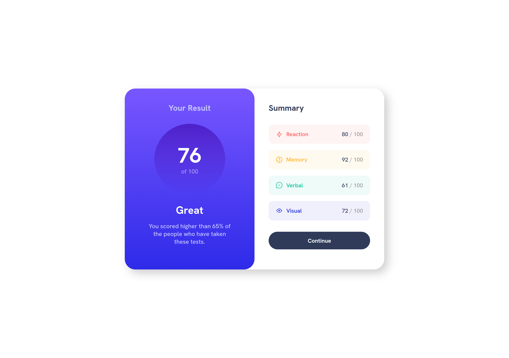
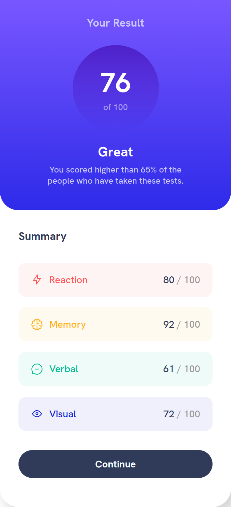

# Frontend Mentor - Results summary component solution

This is a solution to the [Results summary component challenge on Frontend Mentor](https://www.frontendmentor.io/challenges/results-summary-component-CE_K6s0maV). Frontend Mentor challenges help you improve your coding skills by building realistic projects. 

## Table of contents

- [Overview](#overview)
  - [The challenge](#the-challenge)
  - [Screenshot](#screenshot)
  - [Links](#links)
- [My process](#my-process)
  - [Built with](#built-with)
  - [What I learned](#what-i-learned)
  - [Useful resources](#useful-resources)
- [Author](#author)

**Note: Delete this note and update the table of contents based on what sections you keep.**

## Overview

### The challenge

Users should be able to:

- View the optimal layout for the interface depending on their device's screen size
- See hover and focus states for all interactive elements on the page

### Screenshot




### Links

- Solution URL: (https://www.frontendmentor.io/solutions/result-summary-component-main-using-flexbox-CUt5OKZoFO)
- Live Site URL: (https://results-summary-component-main-pi.vercel.app/)

## My process

### Built with

- Semantic HTML5 markup
- CSS custom properties
- Flexbox
- Mobile-first workflow

### What I learned

  I Learned how to make a smooth transition hover effect with linear gradient using the opacity property.

```html
<a href="" class="button">
    <span>Continue</span>
    <div id="color1"></div>
    <div id="color2"></div>
</a>
```
```css
/* Summary Continue Button */
.summary-box .button {
    display: flex;
    justify-content: center;
    align-items: center;
    color: var(--White);
    text-decoration: none;
    font-weight: bold;
    position: relative;
    border-radius: 40px;
    height: 50px;
    margin-bottom: 17px;
}
/* Button Transition Hover Effect */
.summary-box .button span {
    z-index: 99;
}
.summary-box .button #color1 {
    background-color: var(--Dark-gray-blue);
}
.summary-box .button #color2 {
    background-image: linear-gradient(to bottom, var(--Light-slate-blue), var(--Light-royal-blue));
    opacity: 0;
    transition: opacity 0.3s;
}
.summary-box .button #color1,
.summary-box .button #color2 {
    width: 100%;
    height: 100%;
    border-radius: inherit;
    position: absolute;
    top: 0;
    left: 0;
}
.summary-box .button:hover #color2 {
    opacity: 1;
}
```

### Useful resources

- [CSS Reference](https://cssreference.io/) - This helped me remeber how some css properties work.

## Author

- Frontend Mentor - [@nicolas055](https://www.frontendmentor.io/profile/nicolas055)
- Github - [@nicolas055](https://github.com/nicolas055)
